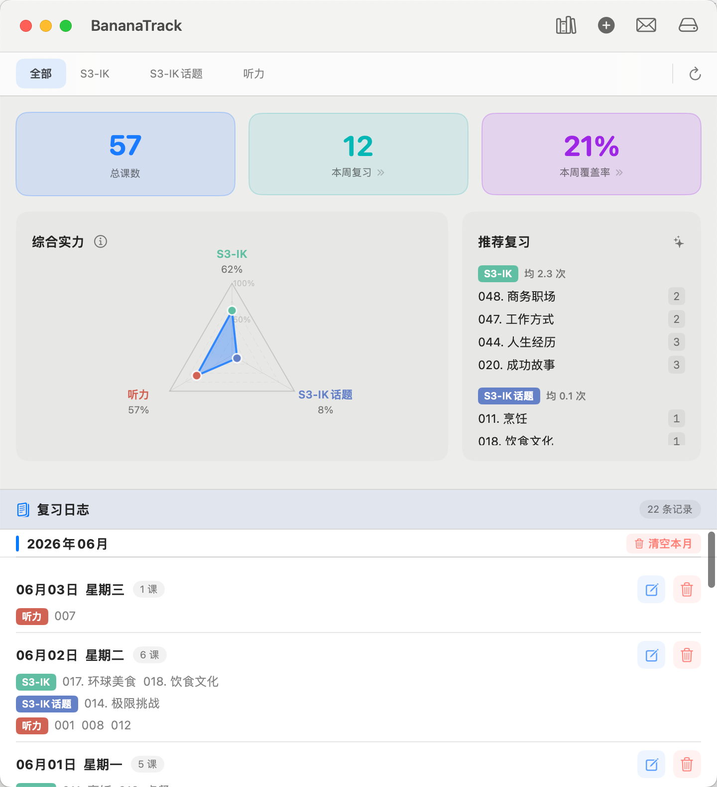

English | [中文](README.md)

# RepTrack

A native macOS app for tracking spaced-repetition language course reviews.



## Features

- **Multi-level course management** — Import lesson folders (e.g. S1-EK, S2-IC, S3-IK) or add lessons manually; drag tabs to reorder levels
- **Batch session logging** — Record multiple lessons across multiple levels and multiple dates in a single save
- **Comprehensive Radar Chart** — Each level is scored out of 100 (Coverage 50pts + Review Depth 50pts); frequency uses a tier system where all lessons must reach N reviews to advance (N is customizable, default 5); click ⓘ for tier details and score breakdown
- **Stat cards** — Total lessons, reviewed count, coverage rate; toggle between Today / This Week / This Month; hover for detailed values
- **Review log** — Chronological list grouped by month; inline edit or delete with confirmation; auto-refreshes on app foreground
- **Daily email reminder** — Send today's recommendations, reviewed content, and yesterday's summary via SMTP directly (no mail client needed); supports QQ / 163 / Gmail / Outlook presets; beautifully formatted HTML email
- **Cloud-sync friendly** — Point the data file at any folder (Nutstore, iCloud Drive, Dropbox) on first launch or via the toolbar; export/import JSON backups at any time

## Requirements

- macOS 14 Sonoma or later
- Xcode 15 or later (to build from source)

## Getting Started

1. Clone the repo and open `RepTrack.xcodeproj` in Xcode
2. Build and run (⌘R)
3. On first launch, choose where to store your data file (default: `~/Library/Application Support/RepTrack/data.json`)
4. Click the folder toolbar icon to import a course directory, or add lessons manually via the level tabs

### Importing a Course Directory

Each selected folder becomes one **level** (e.g. `S3-IK`). Files inside become **lessons** — filenames are parsed as `<number>.<title>`:

```
courses/
├── S1-EK/
│   ├── 001.Simple Past When.md
│   ├── 002.Prepositions of Time.md
│   └── 003.Shopping.md
├── S2-IC/
│   ├── 000.Topic Mastery.md
│   └── 001.Advertising.md
└── S3-IK/
    ├── 011.Cooking.md
    └── 012.Ordering Food.md
```

**Naming rules:**

| Part | Notes | Example |
|------|-------|---------|
| `<number>` | Digits only; leading zeros ignored (`011` = `11`) | `011`, `43` |
| `.` | Separator (ASCII period) | |
| `<title>` | Lesson name; Chinese, English, spaces allowed | `Cooking`, `Simple Past When` |
| Extension | Any (`.md` recommended); non-numeric filenames ignored | `.md` |

**Import behavior:**
- First import: creates levels and lessons from the file list
- Re-import same folder: existing files update title; new files are appended; deleted files are removed and related review log entries are cleaned up
- Multiple folders can be selected and imported in one go

## Adding a Review Session

1. Press **⌘N** or click **+** in the toolbar
2. Click lesson chips to select (highlighted = selected; click again to deselect); switch levels to select across multiple levels
3. Click **添加** to commit the current selection to the pending list
4. Click **保存记录** — sessions are grouped by date automatically

## Data Format

Data is stored as a single JSON file:

```json
{
  "levels": [{ "id": "S3-IK", "lessons": [...], "tierStep": 5 }],
  "sessions": [{ "id": "...", "date": "...", "items": [...] }]
}
```

Export a snapshot anytime via the toolbar cloud icon → **导出备份**, and restore with **从文件导入**.

## Project Structure

```
RepTrack/
├── Models.swift            # Value types (Level, Lesson, ReviewSession, …)
├── DataStore.swift         # @Observable store — CRUD + persistence
├── Helpers.swift           # Pure utilities and StatPeriod enum
├── ContentView.swift       # Root VSplitView layout + toolbar
├── StatsView.swift         # Tab bar + stat cards + radar chart
├── LogView.swift           # Session list with edit/delete
├── AddSessionView.swift    # Add/edit session sheet
├── EmailService.swift      # SMTP email service
├── SMTPSettingsView.swift  # Email configuration UI
├── DataSettingsView.swift  # Storage location + import/export
└── ManageLevelsView.swift  # Level and lesson management
```

---

## License

Copyright © 2026 EddieChan1993. All rights reserved.

This software and its source code are protected by copyright law.

- **No unauthorized commercial use**: Without written authorization from the author, this software or any derivative may not be used for any commercial purpose, including but not limited to sale, rental, bundling, or profit-driven distribution.
- **Personal use only**: Permitted solely for personal, non-commercial use on authorized devices.
- **No redistribution**: Redistributing installers or source code in any form without authorization is prohibited.

For commercial licensing or collaboration, contact: **WeChat: DC_Wen** or **dc_wen666666@163.com**
